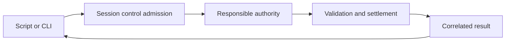

# Scripting Sophia

**Role:** normative target architecture and proposed CLI contract.
**Status:** unimplemented control interface. `sophia msg` is proposed; none of
the command examples below is currently available. This document adds no wire
messages, capabilities, or default enablement.

Sophia supports the architectural goal of a scriptable display server with
replaceable window-manager and shell clients. Scripts request deliberate
changes through a session-owned interface. Each authority interprets its own
operations, and Engine retains validation, scene state, input, rendering,
presentation, and scanout.

This contract applies to any conforming WM or shell. It requires no particular
client executable, implementation language, or private command vocabulary.
[Architecture](architecture.md) owns the authority boundaries;
[Namespaces and Portals](namespaces-and-portals.md) owns resource isolation
and transfers; the [native protocol family](sophia-policy-ipc.md) owns shared
wire and lifecycle rules. This document owns scripting-specific requirements
within those contracts. A future control schema must define the wire before
an independent implementation can be built.

## Current And Proposed Support

| Capability | Current state | Proposed scripting support |
| --- | --- | --- |
| Named WM actions | The WM registers bounded action names and ordinals; existing policy requests carry argument-free actions | Discover and invoke actions through the session control endpoint |
| Profile reload and WM restart | Session operations exist independently of a message CLI | Expose correlated command results through the same owning services |
| Shell behavior | Negotiated descriptor, candidate, presentation, and activation exchanges | A generic shell command catalog needs a separate protocol extension |
| Parameterized commands | The WM action path has no arbitrary argument payload | Specify a bounded argument contract before adding setters |
| State queries and event subscriptions | Role snapshots serve their admitted recipients | A scripting disclosure and subscription contract is future work |
| Public control endpoint | No `sophia msg` service exists | Specify admission, wire, limits, and lifecycle before enabling it |

The existence of a session operation or role message does not make it a public
scripting API. In particular, a shell activation acknowledgement is not a
general command-injection mechanism.

## Ownership And Routing



| Owner | Responsibility |
| --- | --- |
| Session runtime | Endpoint creation, caller admission, command authorization, routing, supervision, revocation, and bounded transport I/O |
| WM client | Registered spatial-command semantics, private model changes, and layout/focus proposals |
| Shell client | Shell presentation policy and permitted interactions within its negotiated role |
| Engine | Authoritative input, scene validation, atomic visual commit, rendering, presentation, and scanout |
| Input, output, session, and portal services | Their existing device, topology, process, capture, and transfer operations under the corresponding authority contracts |

The runtime routes a spatial command without learning the WM's layout
semantics. The WM reduces the admitted action against its private state and
returns a proposal through its existing role connection. The same validation
and settlement rules apply regardless of whether a request originated from a
physical binding or an authorized script. Script provenance must not be
represented as a fabricated physical keypress or trusted user gesture.

No policy process may own a client-facing endpoint. WMs and shells connect to
the session; they do not listen for scripts. The public control endpoint must
be separate from the supervised role endpoints. An admitted scripting client
does not become a WM, shell, or broker peer, and cannot forward their protocol
messages or capabilities as commands.

Scripting also creates no direct WM-to-shell channel. Role-to-role effects
continue through their existing authority paths, including Engine commits and
broker-mediated activation. Session reload, restart, and launch retain their
session ownership even when a WM exposes bindings that request them.

## Proposed CLI

These forms describe the intended first interface; they are not runnable
commands today:

```text
sophia msg commands
sophia msg policy <registered-action>
sophia msg session reload-profile
sophia msg session restart-wm
```

`commands` discovers the operations available to the authorized caller in the
current session. Policy names come from the active WM's admitted catalog;
Sophia must not maintain a second list of WM-specific verbs. Public callers
select names, rather than supplying internal action ordinals, session tokens,
or target handles. Discovery is bounded and does not disclose application
metadata or the WM's private model.

The first policy-command scope is existing argument-free actions. A WM can
provide steps, preset cycles, or bounded configured slots through that catalog.
Absolute setters and other parameterized commands require a separately
specified argument contract: transport bounds belong to Sophia, while spatial
meaning and value validation belong to the WM. Arbitrary payload forwarding
must not stand in for that contract.

Shell discovery and invocation are future extensions. They require negotiated
commands and outcomes appropriate to the shell role. Script access must not
turn a shell into a placement authority or authorize it to select an arbitrary
application by identity. Targeted activation retains its existing broker,
recipient, generation, and presentation requirements.

Invocation, state queries, and event subscriptions are separate permissions.
Permission to change a workspace does not imply permission to enumerate
window titles, read clipboard contents, capture pixels, or subscribe to
application activity. General process execution and synthetic input are also
outside the first command scope.

## Namespace And Caller Security

Three boundaries apply independently:

| Boundary | What it enforces |
| --- | --- |
| Sophia resource namespace | Access to X resources, properties, selections, events, and cross-namespace transfers |
| OS process protection domain | Access to host files, sockets, inherited descriptors, debugging, and other ambient channels |
| Scripting authorization | Which control operations a particular admitted caller may request |

A Sophia namespace is not an OS sandbox. Selecting the confined namespace
profile alone does not prove a process cannot reach a host control socket.
The current confined launcher allocates a namespace for a client group; it
does not automatically isolate every application into a separate namespace.
Classic-shared deliberately permits shared-X access within its group.

X admission, matching UID, possession of a namespace ID, role membership, or
discovery of a socket path does not implicitly grant scripting authority.
Scripts need not be X clients. Where a command needs a namespace context, the
session must derive it from verified admission and authorization; a namespace
field supplied by the caller is never proof. A new control connection must
not inherit an unrelated X connection's permissions merely because their
credentials appear similar.

Two useful authorization scopes must remain distinguishable:

- **Namespace-scoped automation:** acts within the caller's admitted resource
  scope. Cross-namespace access requires the appropriate explicit authority
  or portal flow. A global policy action that cannot honor this scope must be
  refused, rather than silently dispatched as desktop administration.
- **Desktop administration:** deliberately grants control over global desktop
  behavior, such as arranging windows across outputs or changing workspaces.
  These operations may affect windows from several namespaces. They do not
  grant access to those applications' data.

A host-user access mode can deliberately authorize reachable, unconfined
processes running as the session user. That trusts all such processes, not
only a terminal or a selected executable. Owner-only filesystem permissions
exclude other users; they do not provide a same-user application allowlist.
This mode must be named explicitly and must not be advertised as
namespace-restricted scripting. Its default enablement is not decided here.

Selective grants require an enforceable caller boundary. They cannot establish
isolation from an unconfined process that can replace authorized tools, read
their credentials, or modify the session's configuration. Confined callers
need explicit delegation and verified protection against reaching or
inheriting broader host authority. Grant issuance and delivery remain
implementation prerequisites, not existing facilities implied by this text.

The session keeps caller credentials, namespace identity, and authorization
decisions outside the WM. The WM receives only the permitted opaque action
and role facts. Shell command handling retains its negotiated disclosure
limits. Existing clipboard or capture permissions do not authorize desktop
control, and desktop control does not authorize those transfers.

## Completion, Recovery, And Cost

An admitted mutation must retain a correlation identity through dispatch and
the responsible owner's terminal outcome. Requests bind to the applicable
session, recipient, catalog, and authority generations. Admission order is
preserved for ordered commands; relative changes must not be coalesced as if
they were replaceable state updates.

Accepted means admitted for processing. Committed means the responsible
authority settled the change. Presented means the relevant visual state
reached its presentation boundary. These are different outcomes. A CLI must
not report completion merely because it wrote bytes, queued an action, or
observed a replacement process start. No-op success must be explicit where
the owner supports it.

Rejected, stale, revoked, unavailable, overloaded, and timed-out operations
need machine-readable outcomes with bounded diagnostics. A disconnect after
dispatch may leave the caller unsure whether a mutation completed; report
that uncertainty rather than claiming the command had no effect. Automatic
reconnect must not replay an ambiguous mutation. Cancellation must not be
reported as undoing work that already committed.

Role replacement invalidates old recipient/catalog identities. Security
transitions and session teardown revoke affected admission and pending work
under their owning lifecycle rules. Unauthorized or malformed requests must
have no side effects. Failures preserve the last coherent state according to
the owner's recovery contract.

Before exposing reload and restart through this interface, verify their
owner's validation, checkpoint, rollback, and completion behavior. Structural
profile validation alone cannot certify settings whose semantics belong to
the WM. A rejected candidate must preserve or restore the working state;
starting a replacement process is not proof that it restored a usable policy.

Transport must bound message sizes, concurrent connections, outstanding
requests, subscriptions if later admitted, and diagnostic volume. Parsing and
blocking socket I/O stay outside input and rendering work. Session servicing
must enforce fair work budgets so a slow reader or command flood cannot
starve physical input, frame service, security transitions, or recovery.
The hot path must not spawn a process per request or acquire unbounded queues.
Exact limits and measurable service budgets belong to the implementation
contract and its acceptance evidence.

## Guidance For Independent Clients

WM authors keep their action catalog and semantics inside the policy client.
They use the existing action/projection path and preserve commit-aware private
state; they need no scripting listener or metadata access. Adding a command
name does not automatically make every caller eligible to invoke it.

Shell authors use only negotiated shell facts, candidates, and interactions.
A future command extension must state its permitted effects, disclosure,
settlement, and recovery before it can be advertised. Unsupported command
families must fail explicitly rather than fall back to another role's socket.

Scripting-client authors discover available names and support, handle terminal
outcomes, and treat replacement or reconnect as a fresh authority context.
The future interface must be implementable from its published contract and
schema using ordinary Unix IPC, without a required SDK or a reference WM or
shell executable. The proposed CLI is a convenience client of that interface.

## Implementation Prerequisites

Implementation remains candidate work. Before enabling a service, specify and
review its endpoint discovery and caller authentication, authorization scopes,
grant delivery and revocation, default access policy, wire negotiation and
layouts, numeric bounds, command-specific completion, and compatibility rules.
The protocol schema and independent conformance surface must agree with this
architecture. No byte layout or new role capability is established here.

Acceptance must cover unauthorized callers and forged namespace claims,
cross-namespace denial, protected-role isolation, stale/replayed requests,
disconnect ambiguity, ordered mutations, restart and invalid-profile recovery,
slow readers and overload, bounded resources, and input/frame-service
progress during command traffic. Read/query disclosure requires separate
evidence. Existing role conformance does not prove this new service secure.
